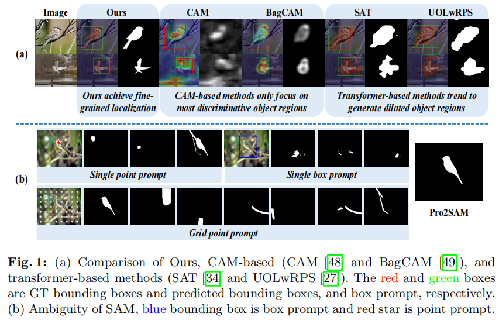
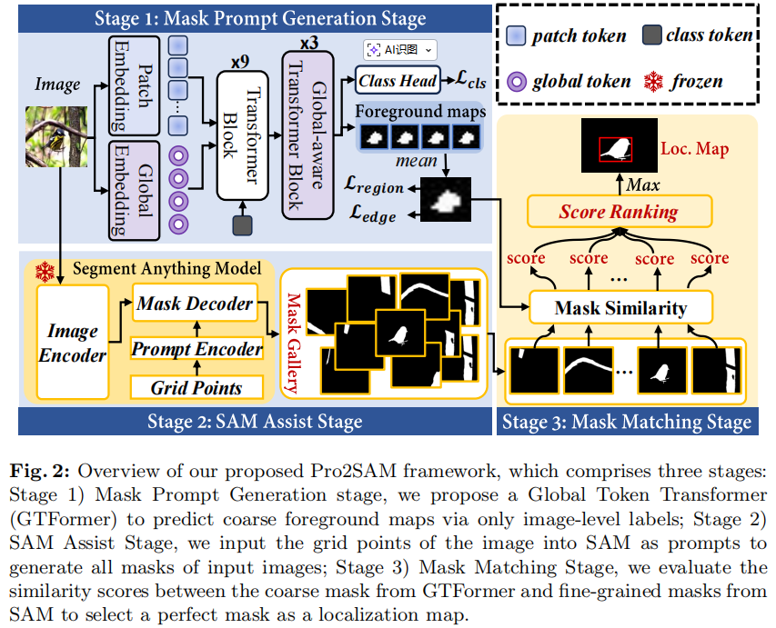
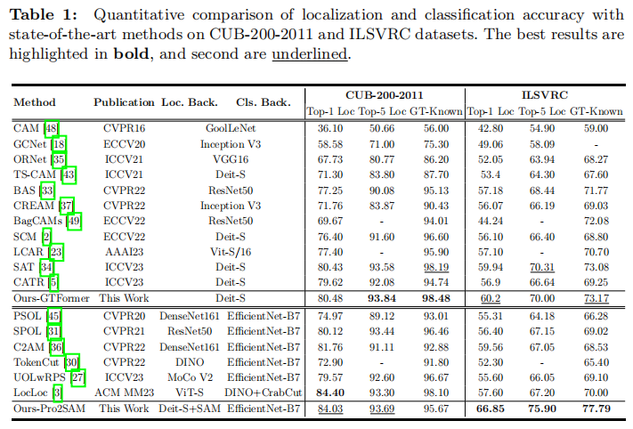
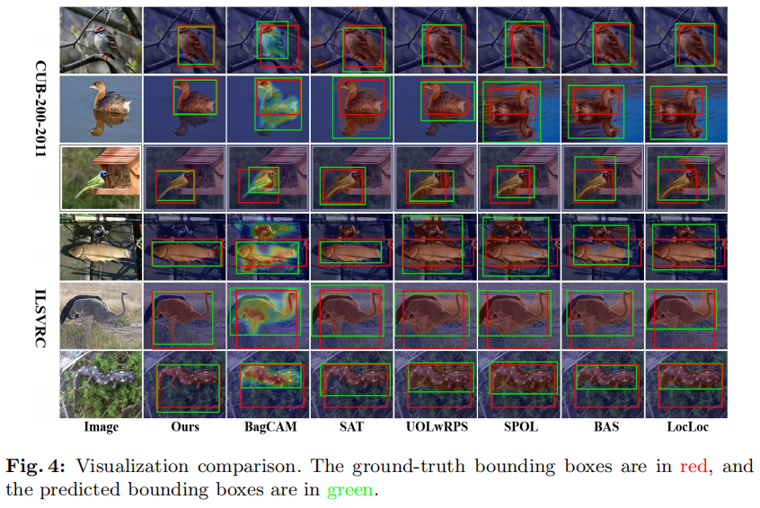

# Pro2SAM: Mask prompt to SAM with grid points for weakly supervised object localization (ECCV2024)

PyTorch implementation of ''Pro2SAM: Mask prompt to SAM with grid points for weakly supervised object localization''. This repository contains PyTorch training code, inference code and pretrained models. 


## 📎 Paper Link <a name="1"></a> 
<a href='https://www.ecva.net/papers/eccv_2024/papers_ECCV/papers/08795.pdf/'></a>
<a href='https://arxiv.org/abs/2505.04905'></a> 

## 💡 Abstract <a name="2"></a> 
 Weakly Supervised Object Localization (WSOL), which aims to localize objects by only using image-level labels, has attracted much attention because of its low annotation cost in real applications. Current studies focus on the Class Activation Map (CAM) of CNN and the self-attention map of transformer to identify the region of objects. However, both CAM and self-attention maps can not learn pixel-level fine-grained information on the foreground objects, which hinders the further advance of WSOL. To address this problem, we initiatively leverage the capability of zero-shot generalization and fine-grained segmentation in Segment Anything Model (SAM) to boost the activation of integral object regions. Further, to alleviate the semantic ambiguity issue accrued in single point prompt-based SAM, we propose an innovative mask prompt to SAM (Pro2SAM) network with grid points for WSOL task. First, we devise a Global Token Transformer (GTFormer) to generate a coarse-grained foreground map as a flexible mask prompt, where the GTFormer jointly embeds patch tokens and novel global tokens to learn foreground semantics. Secondly, we deliver grid points as dense prompts into SAM to maximize the probability of foreground mask, which avoids the lack of objects caused by a single point/box prompt. Finally, we propose a pixel-level similarity metric to come true the mask matching from mask prompt to SAM, where the mask with the highest score is viewed as the final localization map. Experiments show that the proposed Pro2SAM achieves state-of-the-art performance on both CUB-200-2011 and ILSVRC, with 84.03\% and 66.85\% Top-1 Loc, respectively.



## 📖 Method <a name="4"></a> 



**Framework of SAT.** contains three components: (1) GTFormer for coarse foreground map generation; (2) SAM with grid points for mask gallery generation; (3) mask match for selecting foreground map.
## ✏️ Usage <a name="6"></a> 

### Prerequisites <a name="61"></a> 

```bash  
- Python 3.8
- Pytorch 2.0.0
- Torchvision 0.15.1
- Numpy 1.19.2
```

### Download Datasets <a name="62"></a> 

* CUB ([http://www.vision.caltech.edu/visipedia/CUB-200-2011.html](http://www.vision.caltech.edu/visipedia/CUB-200-2011.html))
* ILSVRC ([https://www.image-net.org/challenges/LSVRC/](https://www.image-net.org/challenges/LSVRC/))

### Training <a name="63"></a> 

For CUB:
```bash  
python train_CUB.py  
```

For ImageNet:
```bash  
CUDA_VISIBLE_DEVICES="0,1,2,3" python -m torch.distributed.launch  --master_port 29501 --nproc_per_node 4 train_ImageNet.py
```

### Inference <a name="63"></a> 

To test the localization accuracy on CUB-200, you can download the trained models from Model Zoo, then run `evaluator.py`:
```bash  
python evaluator.py  
```

To test the localization accuracy on ILSVRC, you can download the trained models from Model Zoo, then run `evaluator_ImageNet.py`:
```bash  
python evaluator_ImageNet.py 
```


## 📊 Experimental Results <a name="8"></a> 





## Citation

If you find our work useful in your research, please consider citing:

```
@inproceedings{yang2024pro2sam,
  title={Pro2SAM: Mask prompt to SAM with grid points for weakly supervised object localization},
  author={Yang, Xi and Duan, Songsong and Wang, Nannan and Gao, Xinbo},
  booktitle={European Conference on Computer Vision},
  pages={387--403},
  year={2024},
  organization={Springer}
}
```

## Ackonwledge
Many thanks for SAT:
``` bibtex
@inproceedings{wu2023spatial,
  title={Spatial-aware token for weakly supervised object localization},
  author={Wu, Pingyu and Zhai, Wei and Cao, Yang and Luo, Jiebo and Zha, Zheng-Jun},
  booktitle={Proceedings of the IEEE/CVF International Conference on Computer Vision},
  pages={1844--1854},
  year={2023}
}
```

Many thanks for SAM:
``` bibtex
@inproceedings{kirillov2023segment,
  title={Segment anything},
  author={Kirillov, Alexander and Mintun, Eric and Ravi, Nikhila and Mao, Hanzi and Rolland, Chloe and Gustafson, Laura and Xiao, Tete and Whitehead, Spencer and Berg, Alexander C and Lo, Wan-Yen and others},
  booktitle={Proceedings of the IEEE/CVF international conference on computer vision},
  pages={4015--4026},
  year={2023}
}
```

## ✉️ Statement <a name="9"></a> 
This project is for research purpose only, please contact us for the licence of commercial use. For any other questions please contact [
duanss@stu.xidian.edu.cn](duanss@stu.xidian.edu.cn).


